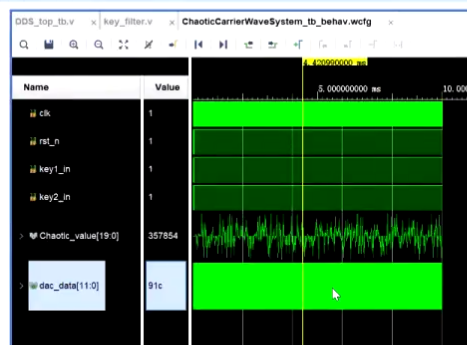

# 基于FPGA的混沌信号发生器

#### 工程介绍：

> 本方案采用Logistic混沌映射发生混沌数据，通过调节stride控制dds发生的载波的频率
>
> 按键1 与 按键2 可以控制载波的类型与幅值（没有具体测试）
>
> 数据将通过串口发送给pc，可以通过SerialPlot串口助手观测到频率不断变化的载波波形
>
> ram表中的数据可以通过matlab程序产生，sin的值已经实现（锯齿，三角，方波还需要模仿正弦的代码写到相应的.v函数中）

#### 实现框图

#### Logistic混沌信号

#### 变频载波

#### SerialPort显示波形

选择下你设备的串口端口号，设置波特率为9600

#### 工程建立教程

> 1.创建一个新的vivado工程
>
> 2.将github上的工程文件添加到vivado的工程中
>
> 3.仿真，**V0.1**版本实际上为了适应串口发送的处理速率，仿真出混沌信号与变频的载波很慢，可以下载**V0.0**版本,看一下没有串口模块的时候，发生看下混沌信号与变频载波的模拟波形
>
> 4.生成比特率，下载，连接pc，串口，打开串口助手SerialPort观看波形